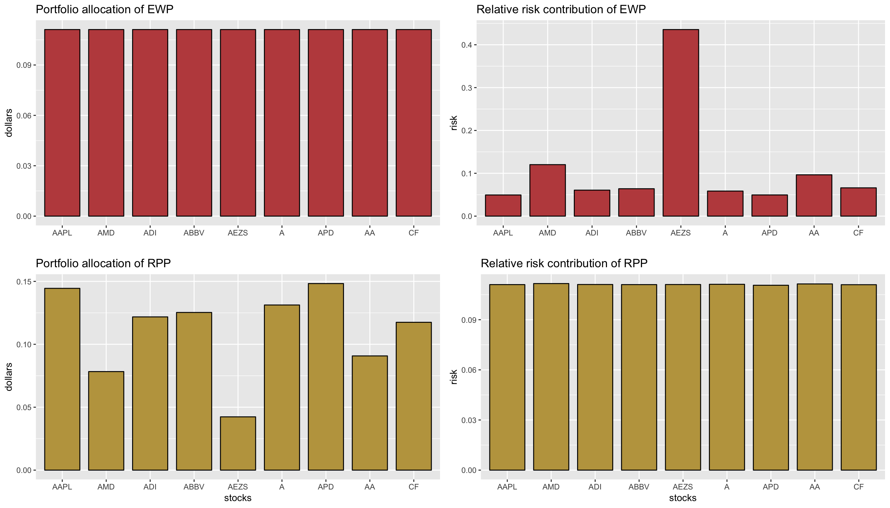

```{r, echo = FALSE}
library(knitr)
opts_chunk$set(
  collapse = TRUE,
  comment = "#>",
  fig.align = "center",
  fig.retina = 2,
  out.width = "85%",
  dpi = 96,
  pngquant = "--speed=1"
)
knit_hooks$set(pngquant = hook_pngquant)
# rmarkdown::render("vignettes/RiskParityPortfolio.Rmd", "prettydoc::html_pretty")
```

-----------
> This vignette illustrates the design of risk parity portfolios, widely
  used by practitioners in the financial industry, with the package
  `riskParityPortfolio`, giving a description of the algorithms used and
  comparing the performance against existing packages.


# Quick Start
```{r, echo = FALSE, eval=FALSE}
# compute Sigma and save it
library(xts)
library(quantmod)

# download data from YahooFinance
stock_namelist <- c("AAPL", "AMD", "ADI",  "ABBV", "AEZS", "A",  "APD", "AA","CF")
prices <- xts()
for (i in 1:length(stock_namelist)) {
  tmp <- Ad(getSymbols(stock_namelist[i], from = "2014-01-01", to = "2016-12-31", auto.assign = FALSE))
  tmp <- na.approx(tmp, na.rm = FALSE)  # interpolate NAs
  prices <- cbind(prices, tmp)
}
colnames(prices) <- stock_namelist
indexClass(prices) <- "Date"

# compute log-returns
X <- diff(log(prices))[-1]

mu <- colMeans(X)
Sigma <- cov(X)

save(Sigma, mu, file = "Sigma_mu.RData")
```
```{r, echo=FALSE}
load("Sigma_mu.RData")
```
First, load package:
```{r, echo=TRUE}
library(riskParityPortfolio)
?riskParityPortfolio  # to get help for the function
```

The simplest use is for the vanilla risk parity portfolio:
```{r, echo=TRUE}
rpp_vanilla <- riskParityPortfolio(Sigma)
names(rpp_vanilla)
print(rpp_vanilla$w, digits = 2)
```

To obtain the naive diagonal solution:
```{r, echo=TRUE}
rpp_naive <- riskParityPortfolio(Sigma, formulation = "diag")
```

For a more realistic formulation including the expected return in the objective and box constraints:
$$\begin{array}{ll}
\underset{\mathbf{w}}{\textsf{minimize}} & \sum_{i,j=1}^{N}\left(w_{i}\left(\boldsymbol{\Sigma}\mathbf{w}\right)_{i}-w_{j}\left(\boldsymbol{\Sigma}\mathbf{w}\right)_{j}\right)^{2} \color{blue}{- \lambda \;\mathbf{w}^T\boldsymbol{\mu}}\\
\textsf{subject to} & \mathbf{w} \ge \mathbf{0}, \quad\mathbf{1}^T\mathbf{w}=1, \quad\color{blue}{\mathbf{l}\le\mathbf{w}\le\mathbf{u}}.
\end{array}$$
```{r, echo=TRUE, size="small"}
rpp_mu <- riskParityPortfolio(Sigma, 
                              mu = mu, lmd_mu = 1e-3,  # for expected return term
                              w_ub = 0.16)             # for box upper bound constraints
```

To plot and compare the results:
```{r, echo=FALSE, fig.width=9, fig.height=5.6, out.width="85%"}
#TODO{Daniel}: implement this new barplot function and also consider the dotplot (http://www.b-eye-network.com/view/2468)
library(PerformanceAnalytics)
library(ggplot2)
library(reshape2)
library(viridis)
# compute risk contributions
N <- length(mu)
w_EWP <- rep(1/N, N)
risk_all <- cbind("EWP"           = as.vector(w_EWP * (Sigma %*% w_EWP)),
                  "RPP (naive)"   = as.vector(rpp_naive$w * (Sigma %*% rpp_naive$w)),
                  "RPP (vanilla)" = as.vector(rpp_vanilla$w * (Sigma %*% rpp_vanilla$w)),
                  "RPP + mu"      = as.vector(rpp_mu$w * (Sigma %*% rpp_mu$w)))
rownames(risk_all) <- colnames(Sigma)
RRC_all <- sweep(risk_all, MARGIN = 2, STATS = colSums(risk_all), FUN = "/")  # normalize each column

# plot (https://www.datanovia.com/en/blog/ggplot-colors-best-tricks-you-will-love/)
ggplot(data = melt(RRC_all), aes(x = Var1, y = value)) + 
  geom_bar(aes(fill = Var2), color = "black", stat = "identity", position = "dodge", width = 0.8) + 
  #scale_fill_manual(values = rainbow6equal[1:4]) +
  scale_fill_viridis(discrete = TRUE) +
  labs(x = "stocks", y = "risk", title = "Risk contribution") +
  theme(plot.title = element_text(size = 16),
        axis.title = element_text(size = 14, color = '#555555'),
        axis.text = element_text(size = 11),
        legend.position = c(0.9, 0.86), #c(0.905, 0.88), 
        legend.title = element_blank(), 
        legend.spacing.x = unit(4, 'pt'),
        legend.text = element_text(size = 13))
# barplot(t(RRC_all), col = rainbow8equal[1:3],
#         main = "Relative risk contribution", xlab = "stocks", ylab = "risk", beside = TRUE, 
#         legend = colnames(RRC_all), args.legend = list(bg = "white"))
```


# What is a Risk Parity Portfolio?
## Signal model
Let us denote the **returns** of $N$ assets at time $t$ with the vector $\mathbf{r}_{t}$ and suppose they follow an i.i.d. distribution (not totally accurate but widely adopted) with mean $\boldsymbol{\mu}$ and covariance matrix $\boldsymbol{\Sigma}$.

The portfolio vector $\mathbf{w}$ denotes the normalized dollar weights allocated to the $N$ assets ($\mathbf{1}^{T}\mathbf{w}=1$) and the **portfolio return** is then $r_{t}^{\sf portf} = \mathbf{w}^{T}\mathbf{r}_{t}$, with expected return $\mathbf{w}^{T}\boldsymbol{\mu}$ and variance $\mathbf{w}^{T}\boldsymbol{\Sigma}\mathbf{w}$.

## Markowitz
Markowitz proposed in his seminar 1952 paper [@Markowitz1952] to find a trade-off between the portfolio expected return and its risk measured by the variance:
$$\begin{array}{ll}
\underset{\mathbf{w}}{\textsf{maximize}} & \mathbf{w}^{T}\boldsymbol{\mu}-\lambda\mathbf{w}^{T}\boldsymbol{\Sigma}\mathbf{w}\\
\textsf{subject to} & \mathbf{w} \ge \mathbf{0}, \quad\mathbf{1}^T\mathbf{w}=1,
\end{array}$$
where $\lambda$ is a parameter that controls how risk-averse the investor is.

Markowitz's portfolio has been heavily critized for over half a century and has never been fully embraced by practitioners, among many reasons because:

- it only considers the risk of the portfolio as a whole and ignores the risk diversification (i.e., concentrates risk too much in few assets, this was observed in the 2008 financial crisis)
- it is highly sensitive to the estimation errors in the parameters (i.e., small estimation errors in the parameters may change completely the designed portfolio).

Although portfolio management did not change much during the 40 years after the seminal works of Markowitz and Sharpe, the development of risk budgeting techniques marked an important milestone in deepening the relationship between risk and asset management.


## From “dollar” to risk diversification
Since the global financial crisis in 2008, **risk management** has particularly become more important than performance management in portfolio optimization. Indeed, risk parity became a popular financial model after the global financial crisis in 2008 [@Qian2005; @Asness_etal2012].

The alternative **risk parity portfolio design** has been receiving significant attention from both the theoretical and practical sides [@Roncalli2013riskparity, @Qian2016] because it

- diversifies the risk, instead of the capital, among the assets
- is less sensitive to parameter estimation errors.

Today, pension funds and institutional investors are using this approach in the development of smart indexing and the redefinition of long-term investment policies.

**Risk parity** is an approach to portfolio management that focuses on **allocation of risk** rather than allocation of capital. The risk parity approach asserts that when asset allocations are adjusted to the same risk level, the portfolio can achieve a higher Sharpe ratio and can be more resistant to market downturns. 

While the minimum variance portfolio tries to minimize the variance (with the disadvantage that a few assets may be the ones contributing most to the risk), the risk parity portfolio tries to constrain **each asset** (or asset class, such as bonds, stocks, real estate, etc.) to **contribute equally to the portfolio overall volatility**.

The term “risk parity” was coined by Edward Qian from PanAgora Asset Management [@Qian2005] and was then adopted by the asset management industry. Some of its theoretical components were developed in the 1950s and 1960s but the first risk parity fund, called the “All Weather” fund, was pioneered by Bridgewater Associates LP in 1996. Interest in the risk parity approach has increased since the late 2000s financial crisis as the risk parity approach fared better than traditionally constructed portfolios.

Some portfolio managers have expressed skepticism but others point to its performance during the financial crisis of 2007-2008 as an indication of its potential success.


The idea of the risk parity portfolio (RPP), aka equal risk portfolio (ERP), is to "equalize" the risk so that the risk contribution from the assets is equal, rather than simply having an equal capital allocation like the equally weighted portfolio (EWP):

```{r, echo=FALSE}

```

## Risk parity portfolio
From Euler's theorem, the volatility of the portfolio $\sigma\left(\mathbf{w}\right)=\sqrt{\mathbf{w}^{T}\boldsymbol{\Sigma}\mathbf{w}}$ can be decomposed as
$$\sigma\left(\mathbf{w}\right)=\sum_{i=1}^{N}w_i\frac{\partial\sigma}{\partial w_i}
= \sum_{i=1}^N\frac{w_i\left(\boldsymbol{\Sigma}\mathbf{w}\right)_{i}}{\sqrt{\mathbf{w}^{T}\boldsymbol{\Sigma}\mathbf{w}}}.$$

The **risk contribution (RC)** from the $i$th asset to the total risk $\sigma(\mathbf{w})$ is defined as
$${\sf RC}_i =\frac{w_i\left(\boldsymbol{\Sigma}\mathbf{w}\right)_i}{\sqrt{\mathbf{w}^{T}\boldsymbol{\Sigma}\mathbf{w}}}$$
which satisfies $\sum_{i=1}^{N}{\sf RC}_i=\sigma\left(\mathbf{w}\right)$.

The **relative risk contribution (RRC)** is a normalized version:
$${\sf RRC}_i = \frac{w_i\left(\boldsymbol{\Sigma}\mathbf{w}\right)_i}{\mathbf{w}^{T}\boldsymbol{\Sigma}\mathbf{w}}$$
so that $\sum_{i=1}^{N}{\sf RRC}_i=1$.

The **risk parity portfolio (RPP)** attemps to “equalize” the risk contributions:
$${\sf RC}_i = \frac{1}{N}\sigma(\mathbf{w})\quad\text{or}\quad{\sf RRC}_i = \frac{1}{N}.$$

More generally, the **risk budgeting portfolio (RBP)** attemps to allocate the risk according to the risk profile determined by the weights $\mathbf{b}$ (with $\mathbf{1}^T\mathbf{b}=1$ and $\mathbf{b}\ge \mathbf{0}$):
$${\sf RC}_i = b_i \sigma(\mathbf{w})\quad\text{or}\quad{\sf RRC}_i = b_i.$$

In practice, one can express the condition ${\sf RC}_i = \frac{1}{N}\sigma(\mathbf{w})$ in different equivalent ways such as
$$w_i(\Sigma \mathbf{w})_{i} = w_j(\Sigma \mathbf{w})_{j}, \quad\forall i, j.$$ The budget condition ${\sf RC}_i = b_i \sigma(\mathbf{w})$ can also be expressed as
$$w_i (\Sigma \mathbf{w})_i = b_i \mathbf{w}^{T}\Sigma\mathbf{w}, \quad\forall i.$$


# Solving the Risk Parity Portfolio (RPP)
## Naive diagonal formulation
Pretending that $\boldsymbol{\Sigma}$ is diagonal and simply using the volatilities $\boldsymbol{\sigma} = \sqrt{{\sf diag(\boldsymbol{\Sigma})}}$, one obtains
$$\mathbf{w} = \frac{\boldsymbol{\sigma}^{-1}}{\mathbf{1}^T\boldsymbol{\sigma}^{-1}}$$
or, more generally,
$$\mathbf{w} = \frac{\sqrt{\mathbf{b}}\odot\boldsymbol{\sigma}^{-1}}{\mathbf{1}^T\left(\sqrt{\mathbf{b}}\odot\boldsymbol{\sigma}^{-1}\right)}.$$
However, for non-diagonal $\boldsymbol{\Sigma}$ or with other additional constraints or objective function terms, a closed-form solution does not exist and some optimization procedures have to be constructed. The previous diagonal solution can always be used and is called _naive risk budgeting portfolio_.


## Vanilla convex formulation
Suppose we only have the constraints $\mathbf{1}^T\mathbf{w}=1$ and $\mathbf{w} \ge \mathbf{0}$. Then after the change of variable $\mathbf{x}=\mathbf{w}/\sqrt{\mathbf{w}^{T}\boldsymbol{\Sigma}\mathbf{w}}$, the equations $w_i (\Sigma \mathbf{w})_i = b_i \mathbf{w}^{T}\Sigma\mathbf{w}$ become $x_i\left(\boldsymbol{\Sigma}\mathbf{x}\right)_i = b_i$ or, more compactly in vector form, as
$$\boldsymbol{\Sigma}\mathbf{x} = \mathbf{b}/\mathbf{x}$$
with $\mathbf{x} \ge \mathbf{0}$ and we can always recover the portfolio by normalizing: $\mathbf{w} = \mathbf{x}/(\mathbf{1}^T\mathbf{x})$.

At this point, one could use a nonlinear multivariate root finder for $\boldsymbol{\Sigma}\mathbf{x} = \mathbf{b}/\mathbf{x}$. For example, in R we can use the package [rootSolve](https://CRAN.R-project.org/package=rootSolve).


With the goal of designing risk budget portfolios, Spinu proposed in [@Spinu2013] to solve the
following convex optimization problem:
$$\underset{\mathbf{x}\ge\mathbf{0}}{\textsf{minimize}} \quad \frac{1}{2}\mathbf{x}^{T}\boldsymbol{\Sigma}\mathbf{x} - \sum_{i=1}^{N}b_i\log(x_i),$$
where the portfolio can be recovered as $\mathbf{w} = \mathbf{x}/(\mathbf{1}^T\mathbf{x})$.

Interestingly, Spinu realized in [@Spinu2013] that precisely the risk budgeting equation $\boldsymbol{\Sigma}\mathbf{x} = \mathbf{b}/\mathbf{x}$ corresponds to the gradient of the convex function $f(\mathbf{x}) = \frac{1}{2}\mathbf{x}^{T}\boldsymbol{\Sigma}\mathbf{x} - \mathbf{b}^T\log(\mathbf{x})$ set to zero: 
$$\nabla f(\mathbf{x}) = \boldsymbol{\Sigma}\mathbf{x} - \mathbf{b}/\mathbf{x} = \mathbf{0}.$$

Thus, a convenient way to solve the problem is by solving the following convex optimization problem:
$$\underset{\mathbf{x}\ge\mathbf{0}}{\textsf{minimize}} \quad \frac{1}{2}\mathbf{x}^{T}\boldsymbol{\Sigma}\mathbf{x} - \mathbf{b}^T\log(\mathbf{x})$$
which has optimality condition $\boldsymbol{\Sigma}\mathbf{x} = \mathbf{b}/\mathbf{x}$.

Such solution can be computed using a general-purpose convex optimization package, but faster algorithms such as **Newton method** and the **cyclical coordinate descent method**, proposed by [@Spinu2013] and [@GriveauRichardRoncalli2013], are implemented in this package. (Yet another convex formulation was proposed in [@KayaLee2012].)


## General nonconvex formulation
The previous methods are based on a convex reformulation of the problem so they are guaranteed to converge to the optimal risk budgeting solution. However, they can only be employed for the simplest risk budgeting formulation with a simplex constraint set (i.e., $\mathbf{1}^T\mathbf{w}=1$ and $\mathbf{w} \ge \mathbf{0}$). They cannot be used if
- we have other constraints like allowing shortselling or box constraints: $l_i \le w_i \le u_i$
- on top of the risk budgeting constraints $w_i\left(\boldsymbol{\Sigma}\mathbf{w}\right)_i = b_i \;\mathbf{w}^{T}\boldsymbol{\Sigma}\mathbf{w}$ we have other objectives like maximizing the expected return $\mathbf{w}^T\boldsymbol{\mu}$ or minimizing the overall variance $\mathbf{w}^T\boldsymbol{\Sigma}\mathbf{w}$.

For those more general cases, we need more sophisticated formulations, which unfortunately are not convex. The idea is to try to achieve equal risk contributions
${\sf RC}_i = \frac{w_i\left(\boldsymbol{\Sigma}\mathbf{w}\right)_i}{\sqrt{\mathbf{w}^{T}\boldsymbol{\Sigma}\mathbf{w}}}$
by penalizing the differences between the terms $w_{i}\left(\boldsymbol{\Sigma}\mathbf{w}\right)_{i}$.

There are many reformulations possible. For illustrative purposes, one such formulation is
$$\begin{array}{ll}
\underset{\mathbf{w}}{\textsf{minimize}} & \sum_{i,j=1}^{N}\left(w_{i}\left(\boldsymbol{\Sigma}\mathbf{w}\right)_{i}-w_{j}\left(\boldsymbol{\Sigma}\mathbf{w}\right)_{j}\right)^{2} \color{blue}{- \;F(\mathbf{w})}\\
\textsf{subject to} & \mathbf{w} \ge \mathbf{0}, \quad\mathbf{1}^T\mathbf{w}=1, \quad\color{blue}{\mathbf{w}\in\cal{W}}
\end{array}$$
where $F(\mathbf{w})$ denotes some additional objective function and $\cal{W}$ denotes an arbitrary convex set of constraints. More expressions for the risk concentration terms are listed in Appendix I.

The way to solve this general problem is derived in [@FengPal2015riskparity, @FengPal2016monograph] and is based on a powerful optimization framework named successive convex approximation (SCA) [@ScuFacSonPal2013]. See Appendix I for a general idea of the method.


# Using the package **riskParityPortfolio**
<!---
TODO{Vinicius}: Revise all this section.
--->

A simple code example on how to design a risk parity portfolio is as follows:
<!---
```{r, echo=FALSE, message=FALSE}
rainbow8equal <- c("#BF4D4D", "#BFA34D", "#86BF4D", "#4DBF69", "#4DBFBF", "#4D69BF", "#864DBF", "#BF4DA3")
```
--->

```{r, message=FALSE}
library(riskParityPortfolio)
library(PerformanceAnalytics)  # for the color palette

# generate synthetic data
set.seed(42)
N <- 10
V <- matrix(rnorm(N^2), nrow = N)
Sigma <- cov(V)

# compute risk parity portfolio
portfolio <- riskParityPortfolio(Sigma)

# plot the portfolio designed
barplot(portfolio$w, main = "Portfolio Weights", xlab = "stocks", ylab = "dollars",
        beside = TRUE, col = rainbow8equal[1], legend = c("riskParityPortfolio"),
        args.legend = list(bg = "white"))
# plot the risk contributions
barplot(portfolio$risk_contribution,
        main = "Risk Contribution of the Portfolios", xlab = "stocks", ylab = "dollars",
        beside = TRUE, col = rainbow8equal[1], legend = c("riskParityPortfolio"),
        args.legend = list(bg = "white"))
```

As presented earlier, the risk parity portfolios are designed in
such a way as to ensure equal risk contribution from the assests,
which can be noted in the chart above.


# Modern Risk Parity Portfolio
The design of risk parity portfolios as solved by [@Spinu2013] and [@GriveauRichardRoncalli2013] is of paramount importance
both for academia and industry. However, practitioners would like the ability to include
additional constraints and objective terms desired in practice, such as the mean return, box constraints, etc.
In such cases, the risk-contribution constraints cannot be met exactly due to the trade-off among different objectives
or additional constraints.

## RPP with additional expected return term
Let us explore, for instance, the effect of including the expected return as an
additional objective in the optimization problem. The problem can be formulated as
$$\begin{array}{ll}
\underset{\mathbf{w}}{\textsf{minimize}} &
R(\mathbf{w}) - \lambda_{\mu} \mathbf{w}^{T}\boldsymbol{\mu}\\
\textsf{subject to} & \mathbf{1}^T\mathbf{w}=1, \mathbf{w} \ge \mathbf{0},
\end{array}$$
where $R(\mathbf{w}) = \sum_{i=1}^{N}\left(w_{i}\left(\boldsymbol{\Sigma}\mathbf{w}\right)_i - b_i\mathbf{w}^T\boldsymbol{\Sigma}\mathbf{w}\right)^{2}$ is the risk concentration function or risk parity function, $\mathbf{w}^{T}\boldsymbol{\mu}$ is the expected return, and $\lambda_{\mu}$ is a trade-off parameter.

```{r, message=FALSE, cache=TRUE}
N <- 10
V <- matrix(rnorm(N^2), nrow = N)
Sigma <- cov(V)
mu <- runif(N)

lmd_sweep <- c(0, 10^seq(-5, 2, .25))
mean_return <- c()
risk_parity <- c()

for (lmd_mu in lmd_sweep) {
  rpp <- riskParityPortfolio(Sigma, mu = mu, lmd_mu = lmd_mu,
                             formulation = "rc-double-index")
  mean_return <- c(mean_return, rpp$mean_return)
  risk_parity <- c(risk_parity, rpp$risk_parity)
}

plot(risk_parity, mean_return, type = "b", pch = 19, cex = .6, col = "blue",
     xlab = "Risk Parity", ylab = "Expected Return",
     ylim = c(min(mean_return), max(mean_return)),
     xlim = c(min(risk_parity), max(risk_parity)),
     main = "Expected Return vs Risk Parity")
```


## RPP with additional variance term
Similarly, the `riskParityPortfolio` package allows us to include the variance
as an objective term, so that the actual optimization problem can be expressed as
$$\begin{array}{ll}
\underset{\mathbf{w}}{\textsf{minimize}} &
R(\mathbf{w}) + \lambda_{\sf var} \mathbf{w}^{T}\boldsymbol{\Sigma}\mathbf{w}\\
\textsf{subject to} & \mathbf{1}^T\mathbf{w}=1, \mathbf{w} \ge \mathbf{0},
\end{array}$$

In the code, that can be done by passing a positive value to the parameter `lmd_var`.
Let's check the following illustrative example that depicts the trade-off between
volatility and risk parity:

```{r, message=FALSE, cache=TRUE}
N <- 10
Sigma <- diag(c(1:N))
lmd_sweep <- c(10 ^ (seq(-5, 5, .25)))
variance <- c()
risk_parity <- c()

for (lmd_var in lmd_sweep) {
  rpp <- riskParityPortfolio(Sigma, lmd_var = lmd_var)
  variance <- c(variance, rpp$variance)
  risk_parity <- c(risk_parity, rpp$risk_parity)
}

volatility <- sqrt(variance)
plot(risk_parity, volatility, type = "b", pch = 19, cex = .6, col = "blue",
     xlab = "Risk Parity", ylab = "Volatility",
     ylim = c(min(volatility), max(volatility)),
     xlim = c(min(risk_parity), max(risk_parity)),
     main = "Volatility vs Risk Parity")
```


## RPP with additional linear constraints
TBD
<!---
TODO{Vinicius}
--->


# Comparison with other Packages
Others R packages with the goal of designing risk parity portfolios do exist,
such as `FinCovRegularization`, `cccp`, and `RiskPortfolios`. Let's check how
do they perform against `riskParityPortfolio`.
(Note that other packages like `FRAPO` use `cccp` under the hood.)

```{r, message=FALSE}
library(FinCovRegularization)
library(cccp)
library(RiskPortfolios)

# generate synthetic data
set.seed(42)
N <- 10
#V <- matrix(rnorm(N^2), nrow = N)  # with this, RiskPortfolios::optimalPortfolio() fails
V <- matrix(rnorm(N*(N+N/5)), N+N/5, N)  # with this, FinCovRegularization::RiskParity() fails
Sigma <- cov(V)

# uniform initial guess for the portfolio weights
w0 <- rep(1/N, N)

# compute risk parity portfolios using different methods
rpp <- riskParityPortfolio(Sigma, w0 = w0, formulation = "rc-double-index")
riskport_w <- optimalPortfolio(Sigma = Sigma, control = list(type = 'erc',
                                                             constraint = 'lo'))
riskport_risk_contribution <- c(riskport_w * (Sigma %*% riskport_w))
fincov_w <- RiskParity(Sigma)
fincov_risk_contribution <- c(fincov_w * (Sigma %*% fincov_w))
cccp_w <- c(getx(rp(w0, Sigma, mrc = w0, optctrl = ctrl(trace = FALSE))))
cccp_risk_contribution <- c(cccp_w * (Sigma %*% cccp_w))

barplot(rbind(rpp$w, fincov_w, cccp_w, riskport_w),
        main = "Portfolios Weights", xlab = "stocks", ylab = "dollars",
        beside = TRUE, col = rainbow8equal[1:4],
        legend = c("riskParityPortfolio", "FinCovRegularization", "cccp",
                   "RiskPortfolios"), args.legend = list(bg = "white"))
barplot(rbind(rpp$risk_contribution, fincov_risk_contribution, cccp_risk_contribution,
              riskport_risk_contribution),
        main = "Risk Contribution of the Portfolios", xlab = "stocks", ylab = "dollars",
        beside = TRUE, col = rainbow8equal[1:4],
        legend = c("riskParityPortfolio", "FinCovRegularization", "cccp",
                   "RiskPortfolios"),
        args.legend = list(x = "bottomright", bg = "white"))
```

Depending on the condition number of the covariance matrix, we found that the
packages `FinCovRegularization` and `RiskPortfolios` may fail unexpectedly.
Apart from that, the other functions perform the same.

Now, let's see a comparison, in terms of computational time, of our cyclical coordinate descent
implementation against the `rp()` function from the `cccp` package and the `optimalPortfolio()` function
from the `RiskPortfolios` package. (For a fair comparison, instead of calling our function `riskParityPortfolio()`,
we call directly the core internal function `risk_parity_portfolio_ccd_spinu()`, which only
computes the risk parity weights, just like `rp()` and `optimalPortfolio()`.)
```{r, cache=TRUE}
library(microbenchmark)
library(cccp)
library(RiskPortfolios)
library(riskParityPortfolio)

N <- 100
V <- matrix(rnorm(N^2), ncol = N)
Sigma <- cov(V)
b <- rep(1/N, N)

# use risk_parity_portfolio_nn with default values of tolerance and number of iterations
op <- microbenchmark(
          rp_cccp = rp(b, Sigma, b, optctrl = ctrl(trace = FALSE)),
          cyclical = riskParityPortfolio:::risk_parity_portfolio_ccd_spinu(Sigma, b, 1e-6, 50),
          optPort = optimalPortfolio(Sigma = Sigma, control = list(type = 'erc', constraint = 'lo')),
          times = 10L)
print(op)
par(mar = c(7, 4, 4, 2))
boxplot(op, main = "Time comparison [milliseconds]",
        xlab = NULL, ylab = NULL,
        unit = "ms", outline = FALSE, las = 2)
```

As it can be observed, our implementation is orders of maginitude faster than
the interior-point method used by `cccp` and the formulation used by `RiskPortfolios`.


<!---
TODO{Vinicius}: Revise the structure of all the appendices given the update I have done above. Note the places where I refer to an appendix, it should be done properly with a markdown code but I don't have the time now to search that.
--->
# Appendix I: Risk concentration formulations {-}
In general, with different constraints and objective functions, exact parity cannot be achieved and one needs to define a risk term to be
minimized: $R(\mathbf{w}) = \sum_{i=1}^{N}\left(g_{i}\left(\mathbf{w}\right)\right)^{2}$, where the $g_{i}$'s denote the different risk contribution errors, e.g., $g_{i} = w_{i}\left(\boldsymbol{\Sigma}\mathbf{w}\right)_i - b_i\mathbf{w}^T\boldsymbol{\Sigma}\mathbf{w}$.
A double-index summation can also be used:
$R(\mathbf{w}) = \sum_{i,j=1}^{N}\left(g_{ij}\left(\mathbf{w}\right)\right)^{2}$.

We consider the risk formulations as presented in [@FengPal2015riskparity, @FengPal2016monograph].
They can be passed through the keyword argument `formulation` in the function
`riskParityPortfolio()`.

The name of the formulations and their mathematical expressions are presented as follows.

**Formulation "rc-double-index"**:
$$R(\mathbf{w}) = \sum_{i,j=1}^{N}\left(w_{i}\left(\boldsymbol{\Sigma}\mathbf{w}\right)_{i}-w_{j}\left(\boldsymbol{\Sigma}\mathbf{w    }\right)_{j}\right)^{2}$$

**Formulation "rc-vs-theta"**:
$$
R(\mathbf{w},\theta) = \sum_{i=1}^{N}\left(w_{i}\left(\boldsymbol{\Sigma}\mathbf{w}\right)_i - \theta \right)^{2}
$$

**Formulation "rc-over-var-vs-b"**:
$$
R(\mathbf{w}) = \sum_{i=1}^{N}\left(\frac{w_{i}\left(\boldsymbol{\Sigma}\mathbf{w}\right)_i}{\mathbf{w}^T\boldsymbol{\Sigma}\mathbf{w}}-b_i\right)^{2}
$$

**Formulation "rc-over-b double-index"**:
$$
R(\mathbf{w}) = \sum_{i,j=1}^{N}\left(\frac{w_i\left(\boldsymbol{\Sigma}\mathbf{w}\right)_i}{b_i} - \frac{w_j\left(\boldsymbol{\Sigma}\mathbf{w}\right)_j}{b_j}\right)^{2}
$$

**Formulation "rc-vs-b-times-var"**:
$$
R(\mathbf{w}) = \sum_{i=1}^{N}\left(w_{i}\left(\boldsymbol{\Sigma}\mathbf{w}\right)_i - b_i\mathbf{w}^T\boldsymbol{\Sigma}\mathbf{w}\right)^{2}
$$

**Formulation "rc-over-sd vs b-times-sd"**:
$$
R(\mathbf{w}) = \sum_{i=1}^{N}\left(\frac{w_{i}\left(\boldsymbol{\Sigma}\mathbf{w}\right)_i}{\sqrt{\mathbf{w}^T\boldsymbol{\Sigma}\mathbf{w}}}-b_i\sqrt{\mathbf{w}^T\boldsymbol{\Sigma}\mathbf{w}}\right)^{2}
$$

**Formulation "rc-over-b vs theta"**:
$$
R(\mathbf{w},\theta) = \sum_{i=1}^{N}\left(\frac{w_{i}\left(\boldsymbol{\Sigma}\mathbf{w}\right)_i}{b_i} - \theta \right)^{2}
$$

**Formulation "rc-over-var"**:
$$
R(\mathbf{w}) = \sum_{i=1}^{N}\left(\frac{w_{i}\left(\boldsymbol{\Sigma}\mathbf{w}\right)_i}{\mathbf{w}^T\boldsymbol{\Sigma}\mathbf{w}}\right)^{2}
$$


# Appendix II: Numerical algorithms for the risk parity portfolio {-}
In this appendix we describe the algorithms implemented for both the vanilla
risk parity portfolio and the modern risk parity portfolio that may contain
additional objective terms and constraints.

## Algorithms for the vanilla risk parity formulation
We now describe the implementation of the Newton method and the cyclical (coordinate) descent algorithm for the vanilla risk parity formulations presented in [@Spinu2013] and [@GriveauRichardRoncalli2013].

Consider the risk budgeting equations
$$w_i\left(\boldsymbol{\Sigma}\mathbf{w}\right)_i = b_i \;\mathbf{w}^{T}\boldsymbol{\Sigma}\mathbf{w}, \qquad i=1,\ldots,N$$
with $\mathbf{1}^T\mathbf{w}=1$ and $\mathbf{w} \ge \mathbf{0}$.

If we define $\mathbf{x}=\mathbf{w}/\sqrt{\mathbf{w}^{T}\boldsymbol{\Sigma}\mathbf{w}}$, then we can rewrite the risk budgeting equations compactly as
$$\boldsymbol{\Sigma}\mathbf{x} = \mathbf{b}/\mathbf{x}$$ with $\mathbf{x} \ge \mathbf{0}$ and we can always recover the portfolio by normalizing: $\mathbf{w} = \mathbf{x}/(\mathbf{1}^T\mathbf{x})$.

Spinu [@Spinu2013] realized that precisely that equation corresponds to the gradient of the function $f(\mathbf{x}) = \frac{1}{2}\mathbf{x}^{T}\boldsymbol{\Sigma}\mathbf{x} - \mathbf{b}^T\log(\mathbf{x})$ set to zero, which is the optimality condition for its minimization.

So we can finally formulate the risk budgeting problem as the following convex optimization problem:
$$\underset{\mathbf{x}\ge\mathbf{0}}{\textsf{minimize}} \quad \frac{1}{2}\mathbf{x}^{T}\boldsymbol{\Sigma}\mathbf{x} - \mathbf{b}^T\log(\mathbf{x}).$$

Roncalli et al. [@GriveauRichardRoncalli2013] proposed a slightly different formulation (also convex):
$$\underset{\mathbf{x}\ge\mathbf{0}}{\textsf{minimize}} \quad \sqrt{\mathbf{x}^{T}\boldsymbol{\Sigma}\mathbf{x}} - \mathbf{b}^T\log(\mathbf{x}).$$

Unfortunately, even though these two problems are convex, they do not conform with the typical classes that most solvers embrace (i.e., LP, QP, QCQP, SOCP, SDP, GP, etc.).

Nevertheless, there are several simple iterative algorithms that can be used, like the Newton method and the cyclical coordinate descent algorithm.

### Newton method
The Newton method obtains the iterates based on the gradient $\nabla f$ and the Hessian ${\sf H}$ of the objective function $f(\mathbf{x})$ as follows:
$$\mathbf{x}^{(k+1)} = \mathbf{x}^{(k)} - {\sf H}^{-1}(\mathbf{x}^{(k)})\nabla f(\mathbf{x}^{(k)})$$

In practice, one may need to use the backtracking method to properly adjust the step size of each iteration [@BoydVandenberghe2004].

* For the function $f(\mathbf{x}) = \frac{1}{2}\mathbf{x}^{T}\boldsymbol{\Sigma}\mathbf{x} -
  \mathbf{b}^T\log(\mathbf{x})$, the gradient and Hessian are given by
    $$\begin{array}{ll}
    \nabla f(\mathbf{x}) &= \boldsymbol{\Sigma}\mathbf{x} - \mathbf{b}/\mathbf{x}\\
    {\sf H}(\mathbf{x}) &= \boldsymbol{\Sigma} + {\sf Diag}(\mathbf{b}/\mathbf{x}^2).
    \end{array}$$

* For the function $f(\mathbf{x}) = \sqrt{\mathbf{x}^{T}\boldsymbol{\Sigma}\mathbf{x}} -
  \mathbf{b}^T\log(\mathbf{x})$, the gradient and Hessian are given by
    $$\begin{array}{ll}
    \nabla f(\mathbf{x}) &= \boldsymbol{\Sigma}\mathbf{x}/\sqrt{\mathbf{x}^{T}\boldsymbol{\Sigma}\mathbf{x}} - \mathbf{b}/\mathbf{x}\\
    {\sf H}(\mathbf{x}) &= \left(\boldsymbol{\Sigma} - \boldsymbol{\Sigma}\mathbf{x}\mathbf{x}^T\boldsymbol{\Sigma}/\mathbf{x}^{T}\boldsymbol{\Sigma}\mathbf{x}\right) / \sqrt{\mathbf{x}^{T}\boldsymbol{\Sigma}\mathbf{x}} + {\sf Diag}(\mathbf{b}/\mathbf{x}^2).
    \end{array}$$

### Cyclical coordinate descent algorithm
This method simply minimizes in a cyclical manner with respect to each element
of the variable $\mathbf{x}$ (denote $\mathbf{x}_{-i}=[x_1,\ldots,x_{i-1},0,x_{i+1},\ldots,x_N]^T$),
while helding the other elements fixed.

* For the function $f(\mathbf{x}) = \frac{1}{2}\mathbf{x}^{T}\boldsymbol{\Sigma}\mathbf{x} -
  \mathbf{b}^T\log(\mathbf{x})$, the minimization w.r.t. $x_i$ is
    $$\underset{x_i>0}{\textsf{minimize}} \quad \frac{1}{2}x_i^2\boldsymbol{\Sigma}_{ii} + x_i(\mathbf{x}_{-i}^T\boldsymbol{\Sigma}_{\cdot,i}) - b_i\log{x_i}$$
with gradient $\nabla_i f = x_i\boldsymbol{\Sigma}_{ii} + (\mathbf{x}_{-i}^T\boldsymbol{\Sigma}_{\cdot,i}) - b_i/x_i$.
Setting the gradient to zero gives us the second order equation
$$x_i^2\boldsymbol{\Sigma}_{ii} + x_i(\mathbf{x}_{-i}^T\boldsymbol{\Sigma}_{\cdot,i}) - b_i = 0$$
with positive solution given by
$$x_i^\star = \frac{-(\mathbf{x}_{-i}^T\boldsymbol{\Sigma}_{\cdot,i})+\sqrt{(\mathbf{x}_{-i}^T\boldsymbol{\Sigma}_{\cdot,i})^2+
4\boldsymbol{\Sigma}_{ii} b_i}}{2\boldsymbol{\Sigma}_{ii}}.$$

* The derivation for the function
$f(\mathbf{x}) = \sqrt{\mathbf{x}^{T}\boldsymbol{\Sigma}\mathbf{x}} - \mathbf{b}^T\log(\mathbf{x})$
follows similarly. The update for $x_i$ is given by
$$x_i^\star = \frac{-(\mathbf{x}_{-i}^T\boldsymbol{\Sigma}_{\cdot,i})+\sqrt{(\mathbf{x}_{-i}^T\boldsymbol{\Sigma}_{\cdot,i})^2+
4\boldsymbol{\Sigma}_{ii} b_i \sqrt{\mathbf{x}^{T}\boldsymbol{\Sigma}\mathbf{x}}}}{2\boldsymbol{\Sigma}_{ii}}.$$

## Successive convex approximation algorithm for the modern risk parity formulation
Many practical formulations deployed to design risk parity portfolios lead to nonconvex problems,
specially when additional objective terms such as mean return or variance, or additional
constraints, namely, shortselling, are taken into account. To circumvent the complications
that arise in such formulations, Feng & Palomar [@FengPal2015riskparity] proposed a method called sucessive convex
approximation (SCA). The SCA method works by convexifying the risk concentration term at some
pre-defined point, casting the nonconvex problem into a much simpler strongly convex
optimization problem. This procedure is then iterated until convergence is achieved. It is important
to highlight that the SCA method always converges to a stationary point.

At the $k$-th iteration, the SCA method aims to solve
\begin{align}\begin{array}{ll}
    \underset{\mathbf{w}}{\textsf{minimize}} & \sum_{i=1}^{n}\left(g_i(\mathbf{w}^k) +
    (\nabla g_i(\mathbf{w}^{k}))^{T}(\mathbf{w} - \mathbf{w}^{k})\right)^2 +
    \tau ||\mathbf{w} - \mathbf{w}^{k}||^{2}_{2} + \lambda F(\mathbf{w})\\
\textsf{subject to} & \mathbf{w}^{T}\mathbf{1} = 1, \mathbf{w} \in \mathcal{W},
\end{array}\end{align}
where the first order Taylor expasion of $g_i(\mathbf{w})$ has been used.

After some mathematical manipulations described in detail in [@FengPal2015riskparity], the optimization
problem above can be rewritten as
\begin{align}\begin{array}{ll}
    \underset{\mathbf{w}}{\textsf{minimize}} & \dfrac{1}{2}\mathbf{w}^{T}\mathbf{Q}^{k}\mathbf{w} +
    \mathbf{w}^{T}\mathbf{q}^{k} + \lambda F(\mathbf{w})\\
\textsf{subject to} & \mathbf{w}^{T}\mathbf{1} = 1, \mathbf{w} \in \mathcal{W},
\end{array}\end{align}
where
\begin{align}
    \mathbf{Q}^{k} & \triangleq 2(\mathbf{A}^{k})^{T}\mathbf{A}^{k} + \tau \mathbf{I},\\
    \mathbf{q}^{k} & \triangleq 2(\mathbf{A}^{k})^{T}\mathbf{g}(\mathbf{w}^{k}) - \mathbf{Q}^{k}\mathbf{w}^{k},
\end{align}
and
\begin{align}
    \mathbf{A}^{k} & \triangleq \left[\nabla_{\mathbf{w}} g_{1}\left(\mathbf{w}^{k}\right), ...,
                              \nabla_{\mathbf{w}} g_{n}\left(\mathbf{w}^{k}\right)\right]^{T} \\
    \mathbf{g}\left(\mathbf{w}^{k}\right) & \triangleq \left[g_{1}\left(\mathbf{w}^{k}\right), ...,
                                                   g_{n}\left(\mathbf{w}^{k}\right)\right]^{T}.
\end{align}

The above problem is a quadratic program (QP) which can be efficiently solved by
standard R libraries. Furthermore, it is straightforward that adding the mean return
or variance terms still keeps the structure of the problem intact.


# Appendix III: Computational time {-}
In the subsections that follows we explore the computational time required by
`method = "sca"`, `method = "alabama"`, and `method = "slsqp"` for some of the formulations presented above.
Additionally, we compare `method = "alabama"` and `method = "slsqp"` without using the
gradient of the objective function.


## Experiment: formulation "rc-over-var vs b"
```{r, message = FALSE, cache=TRUE}
set.seed(42)
N <- 100
V <- matrix(rnorm(N^2), ncol = N)
Sigma <- V %*% t(V)
w0 <- riskParityPortfolio(Sigma, formulation = "diag")$w

res_slsqp <- riskParityPortfolio(Sigma, w0 = w0, formulation = "rc-over-var vs b",
                                 method = "slsqp")
res_slsqp_nograd <- riskParityPortfolio(Sigma, w0 = w0, formulation = "rc-over-var vs b",
                                        method = "slsqp", use_gradient = FALSE)
res_alabama <- riskParityPortfolio(Sigma, w0 = w0, formulation = "rc-over-var vs b",
                                   method = "alabama")
res_alabama_nograd <- riskParityPortfolio(Sigma, w0 = w0, formulation = "rc-over-var vs b",
                                          method = "alabama", use_gradient = FALSE)
res_sca <- riskParityPortfolio(Sigma, w0 = w0, formulation = "rc-over-var vs b",
                               method = "sca")

plot(res_slsqp_nograd$elapsed_time, res_slsqp_nograd$obj_fun, type = "b",
     pch=19, cex=.6, col = "blue", xlab = "Elapsed time (seconds)",
     ylab = "Objective function", main = "Convergence trend versus CPU time",
     ylim = c(0, 0.01))
lines(res_alabama$elapsed_time, res_alabama$obj_fun, type = "b", pch=18, cex=.8,
      col = "red")
lines(res_alabama_nograd$elapsed_time, res_alabama_nograd$obj_fun, type = "b", pch=17,
      cex=.8, col = "purple")
lines(res_slsqp$elapsed_time, res_slsqp$obj_fun, type = "b", pch=16, cex=.8,
      col = "green")
lines(res_sca$elapsed_time, res_sca$obj_fun, type = "b", pch=15, cex=.8,
      col = "black")

legend("topright", legend=c("alabama-nograd",
                            "alabama",
                            "slsqp-nograd",
                            "slsqp",
                            "sca"),
       col=c("purple", "red", "blue", "green", "black"), lty=c(1, 1, 1), cex=0.8, bg = "white")
```


## Experiment: formulation "rc vs b-times-var"
```{r, message = FALSE, cache=TRUE}
res_slsqp <- riskParityPortfolio(Sigma, w0 = w0, formulation = "rc vs b-times-var",
                                 method = "slsqp")
res_slsqp_nograd <- riskParityPortfolio(Sigma, w0 = w0, formulation = "rc vs b-times-var",
                                        method = "slsqp", use_gradient = FALSE)
res_alabama <- riskParityPortfolio(Sigma, w0 = w0, formulation = "rc vs b-times-var",
                                   method = "alabama")
res_alabama_nograd <- riskParityPortfolio(Sigma, w0 = w0, formulation = "rc vs b-times-var",
                                          method = "alabama", use_gradient = FALSE)
res_sca <- riskParityPortfolio(Sigma, w0 = w0, formulation = "rc vs b-times-var",
                               method = "sca")

plot(res_slsqp_nograd$elapsed_time, res_slsqp_nograd$obj_fun, type = "b",
     pch=19, cex=.6, col = "blue", xlab = "Elapsed time (seconds)",
     ylab = "Objective function", main = "Convergence trend versus CPU time",
     ylim = c(0, 0.009))
lines(res_alabama$elapsed_time, res_alabama$obj_fun, type = "b", pch=18, cex=.8,
      col = "red")
lines(res_alabama_nograd$elapsed_time, res_alabama_nograd$obj_fun, type = "b", pch=17,
      cex=.8, col = "purple")
lines(res_slsqp$elapsed_time, res_slsqp$obj_fun, type = "b", pch=16, cex=.8,
      col = "green")
lines(res_sca$elapsed_time, res_sca$obj_fun, type = "b", pch=15, cex=.8,
      col = "black")

legend("topright", legend=c("alabama-nograd",
                            "alabama",
                            "slsqp-nograd",
                            "slsqp",
                            "sca"),
       col=c("purple", "red", "blue", "green", "black"), lty=c(1, 1, 1), cex=0.8)
```


## Experiment: formulation "rc-over-sd vs b-times-sd"
```{r, message = FALSE, cache=TRUE}
res_slsqp <- riskParityPortfolio(Sigma, w0 = w0, formulation = "rc-over-sd vs b-times-sd",
                                 method = "slsqp")
res_slsqp_nograd <- riskParityPortfolio(Sigma, w0 = w0, formulation = "rc-over-sd vs b-times-sd",
                                        method = "slsqp", use_gradient = FALSE)
res_alabama <- riskParityPortfolio(Sigma, w0 = w0, formulation = "rc-over-sd vs b-times-sd",
                                   method = "alabama")
res_alabama_nograd <- riskParityPortfolio(Sigma, w0 = w0, formulation = "rc-over-sd vs b-times-sd",
                                          method = "alabama", use_gradient = FALSE)
res_sca <- riskParityPortfolio(Sigma, w0 = w0, formulation = "rc-over-sd vs b-times-sd",
                               method = "sca")

plot(res_slsqp_nograd$elapsed_time, res_slsqp_nograd$obj_fun, type = "b",
     pch=19, cex=.6, col = "blue", xlab = "Elapsed time (seconds)",
     ylab = "Objective function", main = "Convergence trend versus CPU time",
     ylim = c(0, 0.01))
lines(res_alabama$elapsed_time, res_alabama$obj_fun, type = "b", pch=18, cex=.8,
      col = "red")
lines(res_alabama_nograd$elapsed_time, res_alabama_nograd$obj_fun, type = "b", pch=17,
      cex=.8, col = "purple")
lines(res_slsqp$elapsed_time, res_slsqp$obj_fun, type = "b", pch=16, cex=.8,
      col = "green")
lines(res_sca$elapsed_time, res_sca$obj_fun, type = "b", pch=15, cex=.8,
      col = "black")

legend("topright", legend=c("alabama-nograd",
                            "alabama",
                            "slsqp-nograd",
                            "slsqp",
                            "sca"),
       col=c("purple", "red", "blue", "green", "black"), lty=c(1, 1, 1), cex=0.8, bg = "white")
```


## Experiment with real market data
Now, let us query some real market data (from the package `sparseIndexTracking`)
and check the time comparison of the different methods.

```{r, message = FALSE, cache=TRUE}
library(sparseIndexTracking)
library(xts)
data(INDEX_2010)
Sigma <- cov(INDEX_2010$X)
N <- nrow(Sigma)
w0 <- rep(1/N, N)

res_slsqp <- riskParityPortfolio(Sigma, w0 = w0, formulation = "rc-over-var vs b",
                                 method = "slsqp")
res_slsqp_nograd <- riskParityPortfolio(Sigma, w0 = w0, formulation = "rc-over-var vs b",
                                        method = "slsqp", use_gradient = FALSE)
res_alabama <- riskParityPortfolio(Sigma, w0 = w0, formulation = "rc-over-var vs b",
                                   method = "alabama")
res_alabama_nograd <- riskParityPortfolio(Sigma, w0 = w0, formulation = "rc-over-var vs b",
                                          method = "alabama", use_gradient = FALSE)
res_sca <- riskParityPortfolio(Sigma, w0 = w0, formulation = "rc-over-var vs b",
                               method = "sca")

plot(res_alabama_nograd$elapsed_time, res_alabama_nograd$obj_fun, type = "b",
     pch=19, cex=.6, col = "purple", xlab = "Elapsed time (seconds)",
     ylab = "Objective function", main = "Convergence trend versus CPU time")
lines(res_alabama$elapsed_time, res_alabama$obj_fun, type = "b", pch=18, cex=.8,
      col = "red")
lines(res_slsqp_nograd$elapsed_time, res_slsqp_nograd$obj_fun, type = "b", pch=17,
      cex=.8, col = "blue")
lines(res_slsqp$elapsed_time, res_slsqp$obj_fun, type = "b", pch=16, cex=.8,
      col = "green")
lines(res_sca$elapsed_time, res_sca$obj_fun, type = "b", pch=15, cex=.8,
      col = "black")

legend("topright", legend=c("alabama-nograd",
                            "alabama",
                            "slsqp-nograd",
                            "slsqp",
                            "sca"),
       col=c("purple", "red", "blue", "green", "black"), lty=c(1, 1, 1), cex=0.8,
       bg = "white")
```

It can be noted that the `"alabama"` and `"slsqp"` greatly benefit from the additional gradient
information. Despite that fact, the `"sca"` method still performs faster. Additionally,
in some cases, the `"sca"` method attains a better solution than the other methods.


## Design of high dimensional risk parity portfolio
In order to efficiently design high dimensional portfolios that follows the risk parity criterion,
we implement the cyclical coordinate descent algorithm proposed by [@GriveauRichardRoncalli2013]. In brief, this
algorithm optimizes for one portfolio weight at a time while leaving the rest fixed.

The plot below illustrates the computational scaling of both Newton and cyclical algorithms.
Note that the cyclical algorithm is implemented for two different formulations used by [@Spinu2013]
and [@GriveauRichardRoncalli2013], respectively. Nonetheless, they output the same solution, as they should.
```{r, cache=TRUE}
library(microbenchmark)
library(riskParityPortfolio)

sizes <- c(10, 50, 100, 200, 300, 400, 500, 600, 700)
size_seq <- c(1:length(sizes))
times <- matrix(0, 3, length(sizes))
for (i in size_seq) {
  V <- matrix(rnorm(1000 * sizes[i]), nrow = sizes[i])
  Sigma <- V %*% t(V)
  bench <- microbenchmark(
            newton = riskParityPortfolio(Sigma, method_init="newton"),
            cyclical_spinu = riskParityPortfolio(Sigma, method_init="cyclical-spinu"),
            cyclical_roncalli = riskParityPortfolio(Sigma, method_init="cyclical-roncalli"),
            times = 10L, unit = "ms", control = list(order = "inorder", warmup = 4))
  times[1, i] <- median(bench$time[c(TRUE, FALSE, FALSE)] / 10 ^ 6)
  times[2, i] <- median(bench$time[c(FALSE, TRUE, FALSE)] / 10 ^ 6)
  times[3, i] <- median(bench$time[c(FALSE, FALSE, TRUE)] / 10 ^ 6)
}

colors <- c("#0B032D", "#FFB997", "red")
plot(size_seq, times[1,], type = "b", pch=15, cex=.75, col = colors[1],
     xlab = "Portfolio size N", ylab = "CPU time [ms]", xaxt = "n")
grid()
lines(size_seq, times[2,], type = "b", pch=16, cex=.75, col = colors[2])
lines(size_seq, times[3,], type = "b", pch=17, cex=.75, col = colors[3])
axis(side = 1, at = size_seq, labels = sizes)
legend("topleft", legend = c("newton", "cyclical-spinu", "cyclical-roncalli"),
       col=colors, pch=c(15, 16, 17), lty=c(1, 1, 1), bty="n")
```


# References {-}
\setlength{\parindent}{-0.2in}
\setlength{\leftskip}{0.2in}
\setlength{\parskip}{8pt}
\noindent
